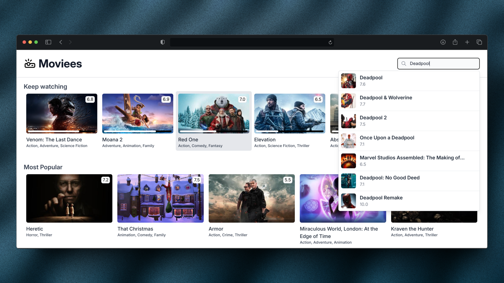

## Welcome to **Moviees** :wave:

Moviees is a web application that allows users to search for movies and view details about them. Users can also view the top rated movies and upcoming movies. The application is built using the [The Movie Database API](https://www.themoviedb.org/documentation/api).

Check out the live demo here: [Moviees Demo](https://moviees.oussamaati.dev/)

### Zoneless

**Moviees** is a zoneless application, meaning it does not rely on Angular's `zone.js`. This approach improves the application's performance by reducing the number of change detection cycles.

- ✅ Leverages Angular's `OnPush` change detection strategy.
- ✅ Employs `signals` for state management, ensuring efficient and predictable updates.
- ✅ Adopts the experimental `ZonelessChangeDetection` option.
- ✅ Uses `withFetch` in `provideHttpClient` instead of the default `xhr` implementation.

### Technologies Used

  
